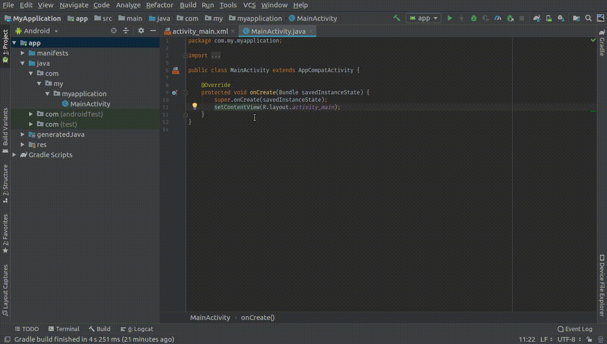
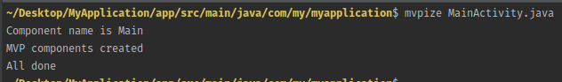

# mvpize
A simple command line utility to create MVP components from an activity



### Installation

 1.Download [mvpize.jar](mvpize.jar) and add below shortcut to your `.bashrc` file
 
 ```
 function mvpize(){
 	java -jar /path/to/mvpize.jar -f $1
 }
```
 2. Call `mvpize` from your `Activity`'s dir
 
   

